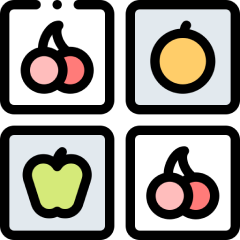
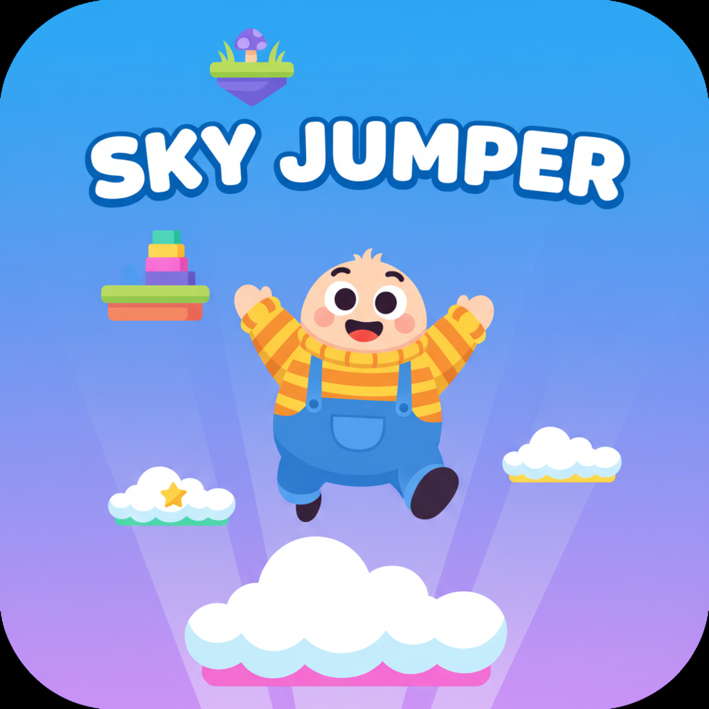
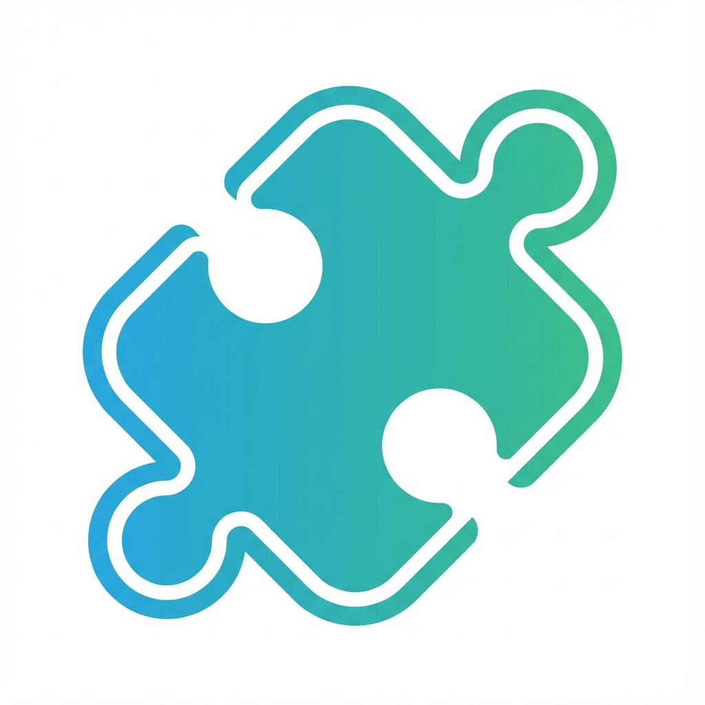
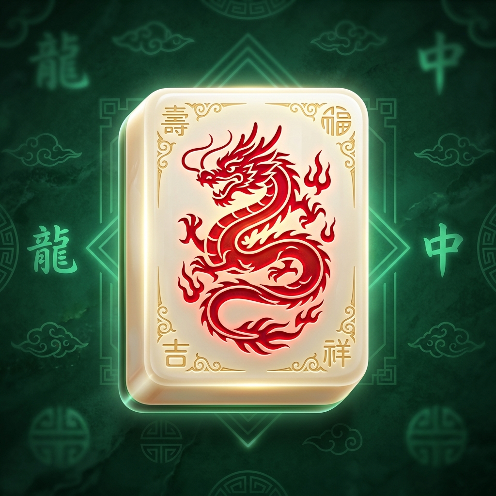
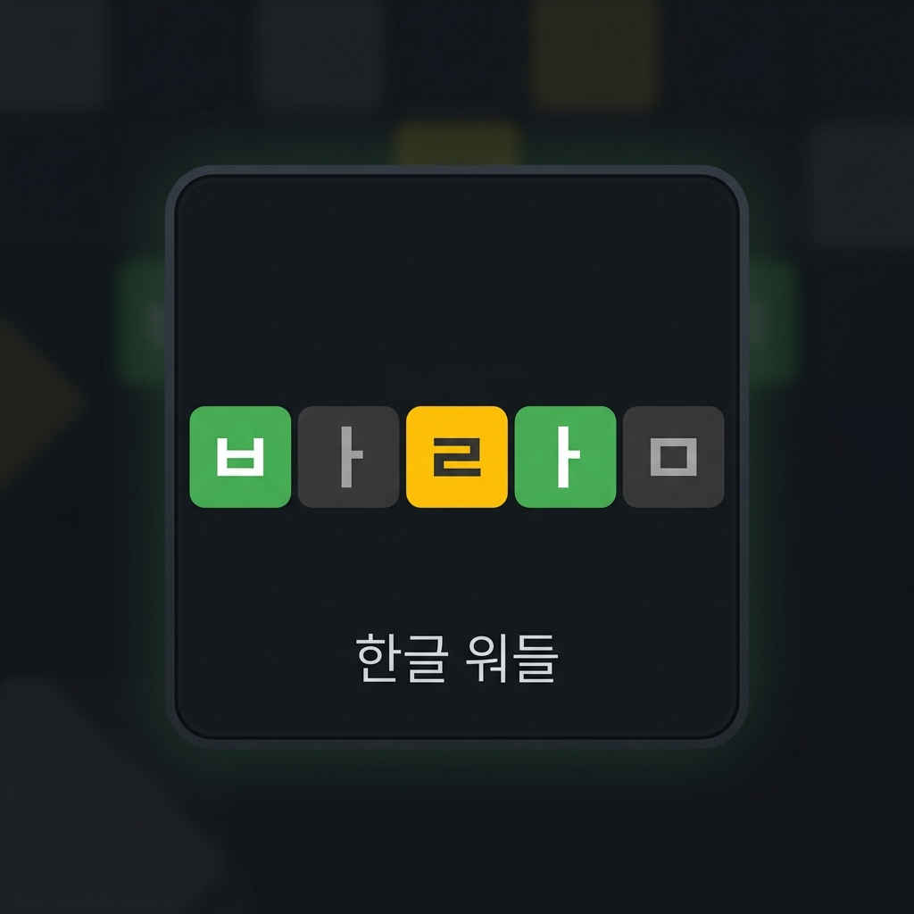
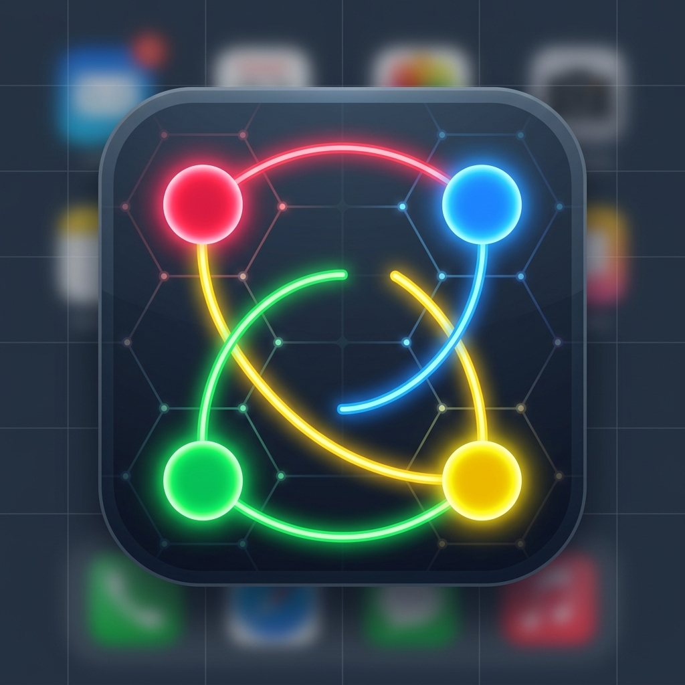

# 🎲 보드게임 도우미 (Board Game Helper)

보드게임을 즐길 때 유용한 보조 도구들과 재미있는 웹 보드게임/퍼즐들을 한곳에 모아둔 프로젝트입니다.

---

## 🚀 제공하는 게임 및 도구 목록

### 💸 모두의 마블 자산관리 (`/modoo`)


- **설명:** 모두의 마블 게임 진행 시 번거로운 지폐 계산을 대신해주는 디지털 자산 관리 도구입니다.
- **주요 기능:**
  - 플레이어 간 자금 이체 및 거래
  - 은행을 통한 예금/출금/월급 지급 기능
  - 실시간 자산 총액 및 거래 히스토리 기록

### 🧠 카드 뒤집기 메모리 게임 (`/memory`)



- **설명:** 무작위로 배치된 카드의 짝을 찾아내는 두뇌 트레이닝 미니게임입니다.
- **주요 기능:**
  - 제한된 기회 안에 모든 카드 쌍 맞추기
  - 직관적이고 깔끔한 매칭 인터페이스 제공

### 🪜 사다리 타기 (`/ladder`)


- **설명:** 벌칙 수행자 선정이나 내기 등 공평한 무작위 결정을 돕는 사다리 타기 도구입니다.
- **주요 기능:**
  - 인원 수 조정 및 사다리 자동 생성
  - 시각적으로 결과를 확인하는 실시간 추적 기능

### 🪂 스카이 점퍼 (`/sky-jumper`)



- **설명:** 하늘을 향해 끊임없이 점프하여 장애물을 피하고 고득점을 노리는 캐주얼 아케이드 게임입니다.

### 🧩 직소 퍼즐 (`/jigsaw`)



- **설명:** 조각난 이미지들을 드래그 앤 드롭으로 맞추어 원래의 그림으로 복원하는 퍼즐 게임입니다.

### 🀄 마작 솔리테어 (`/mahjongg`)



- **설명:** 쌓여 있는 마작 패들 중 같은 무늬의 짝을 찾아 지워나가는 1인용 두뇌 퍼즐 게임입니다.

### 📝 단어 추리 - Wordle (`/wordle`)



- **설명:** 6번의 시도 안에 숨겨진 5글자 단어를 찾아내는 워들(Wordle) 스타일의 단어 추리 게임입니다.
- **주요 기능:**
  - 가상 키보드 및 컬러 힌트 피드백 (초록/노랑/회색)
  - 게임 가이드 및 통계 결과 팝업

### 🎨 색상 선 연결 (`/color-link`)



- **설명:** 겹치지 않게 선을 그려서 같은 색의 점들을 쌍으로 연결하는 직관적이고 중독성 있는 퍼즐 게임입니다.

### 🧪 블록 정렬 퍼즐 (`/block-sort`)


- **설명:** 여러 색의 블록이 무작위로 뒤섞여 있는 튜브들 사이에서 블록을 이동하여, 각 튜브에 하나의 색상 블록만 모으는 두뇌 트레이닝 힐링 퍼즐 게임입니다.
- **주요 기능:**
  - 100% 풀 수 있는 퍼즐 상태만 검증 및 제공 (Solver 탐색 내장)
  - 4단계 난이도 제공 (Easy, Normal, Hard, Expert)
  - **원클릭 스마트 자동 이동**: 블록을 탭했을 때 이동 가능한 튜브가 한 곳이거나 목적지가 명확한 경우(예: 동일 색상의 블록이 있는 튜브), 자동으로 알아서 비행하여 안착되도록 함으로써 터치 피로를 대폭 감소시킵니다.
  - 부드러운 블록 비행 이동 애니메이션 및 3D 뚫린 시험관 튜브 림 구현
  - 한 수 무르기(Undo), 재시작(Restart), 효과음(Web Audio API 전자음 합성) 및 진행 상태 자동 저장

---

## 🛠 기술 스택 (Tech Stack)

- **Framework:** Next.js (App Router)
- **Library:** React, TypeScript
- **Styling:** TailwindCSS
- **State Management:** Jotai
- **UI Components:** Radix UI

---

## 💻 시작 가이드 (Getting Started)

### 의존성 설치
```bash
npm install
```

### 개발 서버 실행
```bash
npm run dev
```

### 빌드 및 배포용 실행
```bash
npm run build
npm start
```
